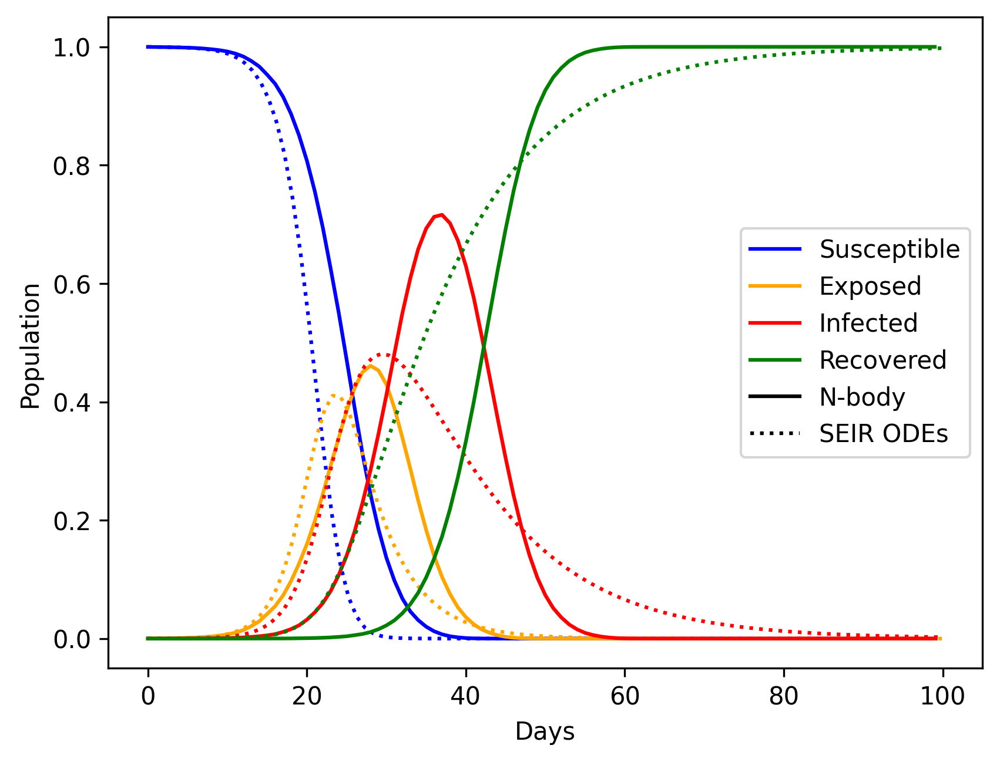
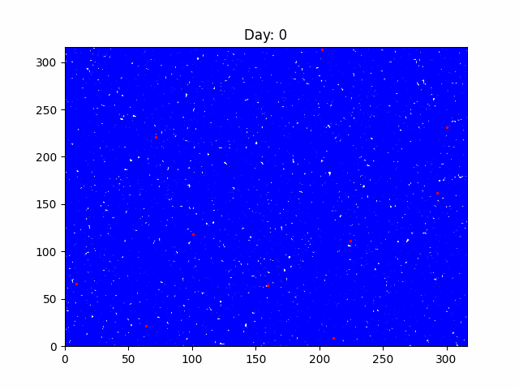

# Copyd

Simple simulator of a pandemic spread, following the [SEIR model](https://www.wikiwand.com/en/Mathematical_modelling_of_infectious_disease).

Evolves the spatial spread of a disease among a susceptible population and creates a GIF.

